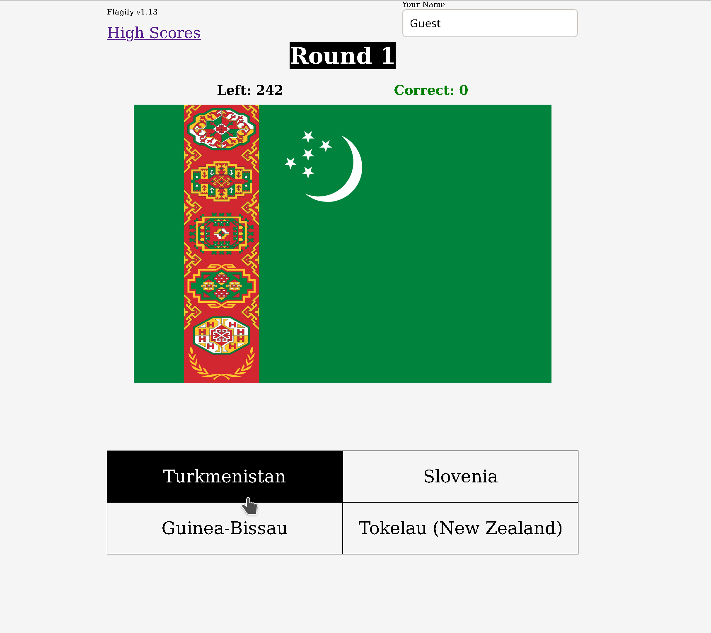

# Flagify

Flagify is a simple vanilla JavaScript country flag guessing game, using firebase to store high scores.

## Usage

[Play Here](https://zilton7.github.io/flagify/)

## Contributing
Pull requests are welcome. For major changes, please open an issue first to discuss what you would like to change.

Please make sure to update tests as appropriate.

## License
[MIT](https://choosealicense.com/licenses/mit/)
